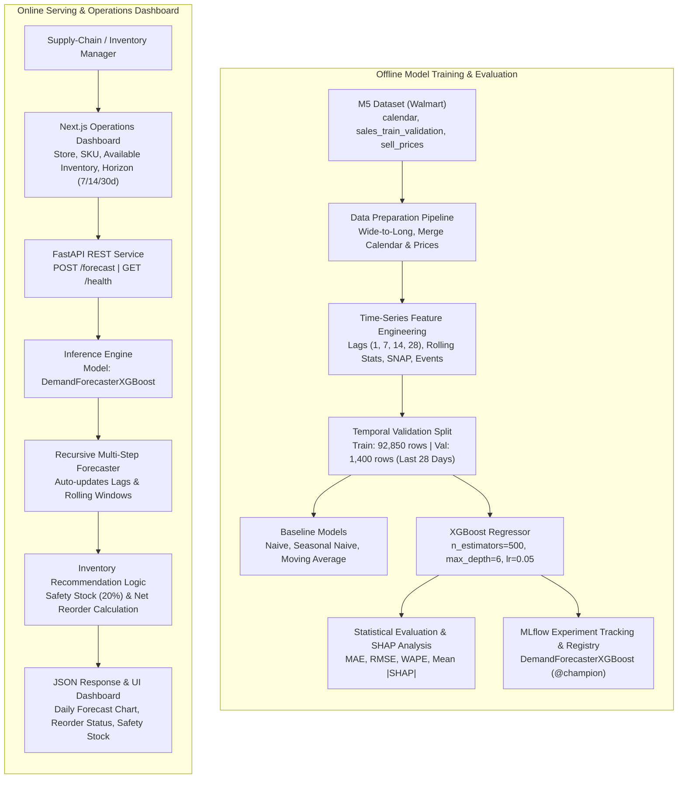
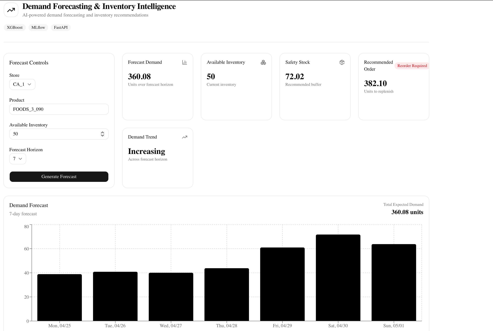
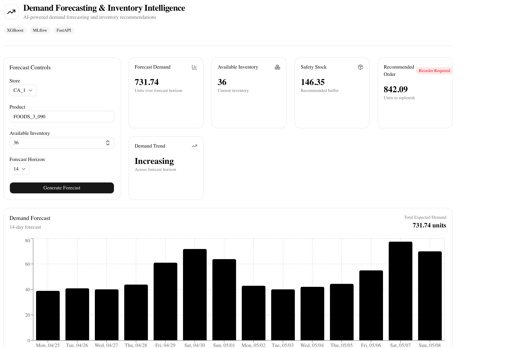

# Demand Forecasting & Inventory Intelligence

An end-to-end, ML-driven demand forecasting and inventory recommendation system built with XGBoost, FastAPI, Next.js, Docker, and MLflow on Walmart M5 retail data.

**In short:** Across the top 50 high-volume store-item series, the XGBoost forecasting model achieved a **22.55% WAPE**, representing a **~22.9% relative reduction** over the best baseline (Moving Average, 29.25% WAPE). In a decision-time closed-loop inventory simulation over a 28-day evaluation window, forecast-driven replenishment reduced the stockout rate from **9.00% to 3.50%** (a **61.1% relative reduction**), increased service level from **91.00% to 96.50%**, and reduced total inventory-related simulation costs by **~15.2%** (14.13 → 11.98).

**Stack:** Python · XGBoost · scikit-learn · SHAP · FastAPI · Next.js · TypeScript · Tailwind CSS · shadcn/ui · Recharts · Docker · Docker Compose · MLflow

---

## 1. Problem

Retail supply-chain and inventory teams face a fundamental operational tension: stockouts lead to unrecoverable lost revenue and diminished customer loyalty, while excess inventory ties up working capital, inflates holding costs, and increases obsolescence risks.

Traditional retail heuristics—such as naive repeat-last-day rules or simple moving averages—fail because SKU-level retail demand is inherently non-stationary. Daily sales exhibit temporal patterns associated with day-of-week seasonality, calendar events, selling prices, and SNAP indicators. A forecasting system must capture these multivariate temporal patterns while translating statistical demand predictions directly into actionable replenishment decisions.

## 2. Business Use Case & Value Framework

This project models the core decision loop of a **retail supply-chain and inventory manager**: determining how many units of a specific product to order for a specific store over an upcoming replenishment horizon.

```
+-----------------------------------------------------------------------------------+
|                            RETAIL VALUE FRAMEWORK                                 |
+------------------------------------+----------------------------------------------+
| Under-Ordering Risk (Stockouts)    | Lost revenue, backorders, brand erosion      |
| Over-Ordering Risk (Excess Stock)  | Working capital lockup, storage cost, waste   |
| Optimization Goal                  | Maximize service level while minimizing cost |
+------------------------------------+----------------------------------------------+
```

To bridge the gap between statistical forecasting and business operations, point forecasts are converted into net reorder recommendations using safety stock buffers. This enables evaluation not merely on statistical error metrics (MAE, RMSE, WAPE), but on operational supply-chain outcomes: stockout incidence, fulfillment service level, and net inventory holding and penalty costs.

## 3. System Architecture

The repository separates offline model experimentation and validation from online low-latency inference and operations dashboard serving:



## 4. Dataset & Temporal Validation

### Dataset Source
The system is built using the [Kaggle M5 Forecasting – Accuracy](https://www.kaggle.com/competitions/m5-forecasting-accuracy/data) benchmark, which comprises hierarchical Walmart sales data across three US states (California, Texas, Wisconsin):

- `sales_train_validation.csv`: Daily unit sales per product-store series.
- `calendar.csv`: Dates, day-of-week, event flags, and SNAP purchase allowance indicators.
- `sell_prices.csv`: Store- and product-specific weekly selling prices.

*(Note: `sales_train_evaluation.csv` and `sample_submission.csv` were not used in this implementation.)*

### Data Preparation & Scope
1. Daily sales were unpivoted from wide format to a unified long time series.
2. Calendar attributes and weekly sell prices were joined temporally. Missing price entries were handled systematically during feature extraction.
3. The full processed dataset contains **58,327,370 rows** spanning from **2011-01-29 through 2016-04-24**.
4. **Scope boundary:** To ensure complete computational reproducibility, the modeling dataset filters to the **top 50 store-item series** ranked by total historical sales volume. The final modeled dataset contains **94,250 rows and 27 columns** spanning **2011-02-26 through 2016-04-24** (after accommodating maximum feature lag windows).

### Temporal Validation Strategy
Because time-series observations are sequentially dependent, standard random train/test splitting introduces severe future-to-past lookahead leakage. Validation uses a strictly time-based split:

- **Training period:** 2011-02-26 through 2016-03-27 (**92,850 rows**)
- **Validation period:** 2016-03-28 through 2016-04-24 (**1,400 rows**, covering the final 28 days across all 50 series)

## 5. Baselines

To establish meaningful benchmark thresholds, three standard time-series baselines were implemented and evaluated on the exact 28-day validation horizon (`reports/baseline_results.csv`):

1. **Naive:** Predicts demand at day $t$ as equal to demand at day $t-1$.
2. **Seasonal Naive (7-day):** Predicts demand at day $t$ as equal to demand at day $t-7$ to capture weekly seasonality.
3. **Moving Average (7-day):** Predicts demand at day $t$ as the trailing 7-day arithmetic mean.

| Model | MAE | RMSE | WAPE | Benchmark Context |
| :--- | :---: | :---: | :---: | :--- |
| **Naive** | 12.1736 | 19.0373 | 31.6437% | Basic persistence baseline |
| **Seasonal Naive** | 11.6086 | 18.0619 | 30.1751% | Captures weekly cyclicality |
| **Moving Average (7-day)** | **11.2509** | **16.4727** | **29.2454%** | **Strongest baseline**; smooths high-frequency noise |

The 7-day Moving Average established the primary benchmark target with a **29.2454% WAPE**.

## 6. Machine Learning Methodology

### Feature Engineering
The final model consumes **19 structured features** engineered without lookahead bias:

- **Autoregressive Lags:** `lag_1`, `lag_7`, `lag_14`, `lag_28`
- **Rolling Window Statistics:** `rolling_mean_7`, `rolling_mean_14`, `rolling_mean_28`, `rolling_std_7`, `rolling_std_14`, `rolling_std_28`
- **Calendar & Seasonality:** `day_of_week` (0–6), `month_num` (1–12), `year_num`, `week_of_year`, `event_flag` (binary holiday indicator)
- **Economic & Policy Signals:** `sell_price`, `snap_CA`, `snap_TX`, `snap_WI`

### XGBoost Model Configuration
The forecasting engine uses an `XGBRegressor` trained on squared error loss with mean absolute error tracking:

```python
XGBRegressor(
    n_estimators=500,
    max_depth=6,
    learning_rate=0.05,
    subsample=0.8,
    colsample_bytree=0.8,
    objective="reg:squarederror",
    eval_metric="mae",
    n_jobs=4,
    random_state=42
)
```

### Validation Performance
On the 28-day temporal validation holdout, XGBoost delivered substantial improvements across all evaluation dimensions:

- **MAE:** 8.6744 (vs. baseline 11.2509)
- **RMSE:** 12.6023 (vs. baseline 16.4727)
- **WAPE:** **22.5481%** (vs. baseline 29.2454%)
- **Relative WAPE Reduction:** **~22.9%**

$$\text{Relative WAPE Reduction} = \frac{29.2454\% - 22.5481\%}{29.2454\%} \approx 22.90\%$$

### Recursive Multi-Step Forecasting
At inference time, managers require multi-day projections (7, 14, or 30 days). The system employs a recursive multi-step forecasting engine:

1. Step 1 ($t+1$) is predicted using true historical sales.
2. For step $k$ ($t+k$), predicted sales from steps $t+1 \dots t+k-1$ are dynamically fed back into the feature matrix to update `lag_1`, rolling means, and rolling standard deviations.
3. Exogenous calendar signals (`day_of_week`, `week_of_year`, `month_num`) increment deterministically along the forecast horizon.
4. *Scope assumption:* Future sell prices, holiday events, and SNAP flags are carried forward from the latest available observation.

## 7. Model Explainability

Feature attribution was computed on the validation split using TreeSHAP (`reports/xgboost_shap_feature_importance.csv`):

| Feature | Mean |SHAP Value| | Role in Demand Generation |
| :--- | :---: | :--- |
| `lag_1` | **8.6712** | Immediate prior-day demand persistence |
| `rolling_mean_7` | **5.6651** | Trailing weekly baseline volume |
| `day_of_week` | **4.2068** | Weekend vs. weekday traffic surges |
| `rolling_mean_28` | **1.2351** | Long-term monthly trend level |
| `lag_28` | **1.1194** | Monthly seasonal recurrence |
| `lag_14` | **1.0583** | Bi-weekly cyclical pattern |
| `lag_7` | **0.9524** | Same-day prior-week baseline |

SHAP analysis confirms that predictions are predominantly anchored in short-term autoregressive signals (`lag_1`), trailing weekly momentum (`rolling_mean_7`), and weekly day-of-week seasonality. (Note: SHAP reflects statistical feature contributions within the validation sample and does not assert direct real-world causal mechanisms.)

## 8. Inventory Intelligence

### Replenishment Policy & Order Sizing
Statistical forecasts are translated into procurement recommendations using a safety-stock-augmented reorder policy:

$$\text{Recommended Order} = \max\left(0, \, \text{Forecast Demand} + \text{Safety Stock} - \text{Available Inventory}\right)$$

In this MVP implementation, safety stock is configured as a 20% demand buffer:

$$\text{Safety Stock} = \text{Forecast Demand} \times 0.20$$
$$\text{Recommended Order} = \max\left(0, \, 1.20 \times \text{Forecast Demand} - \text{Available Inventory}\right)$$

### Decision-Time Simulation Results
To evaluate practical operational effectiveness, a closed-loop simulation was executed over the 28-day validation window across all 50 series (`reports/inventory_simulation_decision_time.csv`):

- **Simulation cadence:** Reorder decisions made every 7 days using strictly data available prior to decision time.
- **Strategies compared:** 7-day Moving Average heuristic vs. XGBoost Recursive Forecaster.
- **Parameters:** Uniform 1.20 inventory buffer, unit holding cost = 0.10, unit stockout penalty cost = 2.00.

| Metric | Baseline Strategy (7-day MA) | Forecast-Driven Strategy (XGBoost) | Operational Impact |
| :--- | :---: | :---: | :--- |
| **Stockout Rate** | 9.00% | **3.50%** | **-5.50 pp** (61.1% relative reduction) |
| **Service Level** | 91.00% | **96.50%** | **+5.50 pp** improvement |
| **Average Excess Inventory** | **52.61** | 62.89 | +10.28 units buffer expansion |
| **Inventory-Related Cost** | 14.13 | **11.98** | **-15.2%** relative cost reduction |

**Simulation Interpretation:** By dynamically adapting to upcoming peaks and troughs rather than lagging behind them, the forecast-driven strategy strategically increased average buffer inventory during high-risk periods. This eliminated more than 60% of stockout events, raising service levels from 91% to 96.5% and achieving a net 15.2% cost reduction under the asymmetric holding-versus-stockout cost structure.

### Concrete Verified Example
For Store `CA_1`, Item `FOODS_3_090`, with 50 units of available inventory over a 7-day horizon:

- **Recursive Daily Predictions:**
  - 2016-04-25: 38.87 units
  - 2016-04-26: 40.85 units
  - 2016-04-27: 40.05 units
  - 2016-04-28: 43.80 units
  - 2016-04-29: 60.99 units
  - 2016-04-30: 71.74 units
  - 2016-05-01: 63.79 units
- **Total Forecast Demand:** 360.08 units
- **Safety Stock (20%):** 72.02 units
- **Recommended Order:** **382.10 units** ($360.08 + 72.02 - 50.00 = 382.10$)

## 9. Benchmark Results

### Model Forecasting Accuracy (28-Day Holdout)
| Model | MAE | RMSE | WAPE | Relative WAPE vs. Best Baseline |
| :--- | :---: | :---: | :---: | :---: |
| Naive | 12.1736 | 19.0373 | 31.6437% | +8.20% |
| Seasonal Naive | 11.6086 | 18.0619 | 30.1751% | +3.18% |
| Moving Average (7-day) | 11.2509 | 16.4727 | 29.2454% | Baseline (0.00%) |
| **XGBoost Regressor** | **8.6744** | **12.6023** | **22.5481%** | **-22.90%** |

### Decision-Time Operational Simulation
| Strategy | Stockout Rate | Service Level | Avg. Excess Inventory | Total Simulation Cost |
| :--- | :---: | :---: | :---: | :---: |
| Moving Average Baseline | 9.00% | 91.00% | 52.61 units | 14.13 |
| **Forecast-Driven (XGBoost)** | **3.50%** | **96.50%** | **62.89 units** | **11.98** |

## 10. Frontend Dashboard

The operational dashboard is built with **Next.js (App Router), TypeScript, Tailwind CSS, shadcn/ui, and Recharts**. It provides supply-chain planners with store and SKU selection, configurable inventory inputs, forecast horizon toggles (7, 14, or 30 days), KPI summary cards, demand trend alerts, and interactive daily projections.

### 7-Day Forecast Dashboard



### 14-Day Forecast Dashboard



## 11. API Specification

The inference backend is implemented using **FastAPI** and served via Uvicorn.

### Health Check
- **Endpoint:** `GET /health`
- **Response:**
  ```json
  {
    "status": "healthy",
    "service": "demand-forecasting-api"
  }
  ```

### Forecast & Recommendation
- **Endpoint:** `POST /forecast`
- **Request:**
  ```json
  {
    "store_id": "CA_1",
    "item_id": "FOODS_3_090",
    "available_inventory": 50,
    "forecast_days": 7
  }
  ```
- **Response:**
  ```json
  {
    "store_id": "CA_1",
    "item_id": "FOODS_3_090",
    "forecast_days": 7,
    "daily_forecast": [
      {"date": "2016-04-25", "forecast": 38.866458892822266},
      {"date": "2016-04-26", "forecast": 40.85276794433594},
      {"date": "2016-04-27", "forecast": 40.05023193359375},
      {"date": "2016-04-28", "forecast": 43.796329498291016},
      {"date": "2016-04-29", "forecast": 60.98594665527344},
      {"date": "2016-04-30", "forecast": 71.74065399169922},
      {"date": "2016-05-01", "forecast": 63.79021072387695}
    ],
    "inventory": {
      "forecast_demand": 360.08,
      "available_inventory": 50.0,
      "safety_stock": 72.02,
      "recommended_order": 382.1
    }
  }
  ```

## 12. MLOps & Reproducibility

- **Experiment Tracking:** MLflow tracks training metrics, validation MAE/RMSE/WAPE, and hyperparameter dictionaries under experiment `demand-forecasting-xgboost`.
- **Model Registry & Quality Gate:** `DemandForecasterXGBoost` is managed through the MLflow Model Registry using the `champion` alias. Model promotion is automated via an isolated Model Quality Gate that compares candidate metrics against baseline benchmarks, current champion performance, and guardrails before promoting (latest validated promotion run: `4183d9a6ae91402da1c7814502c53fb7`).
- **Containerization:** Containerized FastAPI and Next.js services with isolated runtime environments.
- **Dependency Isolation:** Strict separation between development (`requirements-dev.txt`) and production deployment (`requirements-prod.txt`).
- **Data Integrity:** Strict temporal cutoffs prevent leakage during feature generation and recursive inference.

## 13. Limitations & Production Scope

To maintain rigorous engineering honesty, the following MVP design boundaries should be noted:

1. **Modeling Scope:** The current pipeline trains and evaluates on the top 50 high-volume store-item series. It is not currently deployed across all 30,490 series in the complete M5 hierarchical dataset.
2. **Heuristic Safety Stock:** Safety stock is calculated using a fixed 20% demand percentage heuristic rather than a full stochastic replenishment optimizer (e.g., dynamic lead-time variance modeling or $(s, S)$ continuous-review policies).
3. **Exogenous Variable Roll-Forward:** In recursive multi-step forecasting, future sell prices, holiday events, and SNAP flags are forward-filled from the latest observed value rather than ingested from a live external pricing and promotional calendar service.
4. **Simulation Boundaries:** The inventory simulation demonstrates policy behavior under explicit, fixed holding cost (0.10) and stockout penalty (2.00) parameters. It should be understood as an offline validation simulation, not a measured empirical business impact from live production retail deployment.

## 14. Project Structure

```
.
├── data/
│   ├── raw/                  # Downloaded Kaggle M5 CSVs (gitignored)
│   └── processed/            # Processed modeling parquet tables (gitignored)
├── docs/
│   └── images/               # Dashboard screenshots
├── frontend/
│   ├── src/
│   │   ├── app/              # Next.js App Router (page.tsx, layout.tsx)
│   │   └── components/       # shadcn/ui and custom dashboard components
│   ├── Dockerfile            # Frontend container specification
│   └── package.json
├── models/                   # Serialized model artifacts (gitignored)
├── reports/
│   ├── figures/              # Evaluation plots & create_evaluation_figures.py
│   ├── baseline_results.csv  # Verified baseline metrics
│   ├── inventory_simulation_decision_time.csv # Verified simulation metrics
│   └── xgboost_shap_feature_importance.csv    # Verified SHAP metrics
├── src/
│   ├── api.py                # FastAPI REST endpoints
│   ├── data/                 # Wide-to-long transformation & preprocessing
│   ├── evaluation/           # Baselines, simulation, and SHAP explainability
│   ├── features/             # Time-series feature engineering pipeline
│   ├── inference/            # Recursive multi-step forecaster
│   ├── inventory/            # Replenishment & safety stock recommendation
│   └── models/               # Model training scripts (train_xgboost.py, train_model.py)
├── Dockerfile                # Backend container specification
├── docker-compose.yml        # Full-stack container orchestration
├── requirements-dev.txt      # Development dependencies
├── requirements-prod.txt     # Production dependencies
└── README.md
```

## 15. How to Run & Reproduce

### Data & Model Artifact Reproduction Sequence
The raw Walmart M5 dataset, processed parquet tables, and trained model artifacts are excluded from git version control due to dataset licensing and file size constraints (~1 GB raw, ~2.9 MB model). Because the backend Docker container directly packages `data/processed/model_data.parquet` and `models/demand_forecaster_xgboost.json`, these artifacts must be generated locally prior to building Docker images.

#### Step 1: Raw M5 Dataset Download
Download the competition files from [Kaggle M5 Forecasting – Accuracy](https://www.kaggle.com/competitions/m5-forecasting-accuracy/data) and place the following three CSVs into `data/raw/`:
- `data/raw/calendar.csv`
- `data/raw/sales_train_validation.csv`
- `data/raw/sell_prices.csv`

#### Step 2: Environment Setup
```bash
# Create and activate virtual environment
python3 -m venv .venv
source .venv/bin/activate

# Install development and training dependencies
pip install -r requirements-dev.txt
```

#### Step 3: Data Transformation & Feature Engineering
Run the repository pipelines to generate the processed parquet tables:
```bash
# 1. Unpivot daily sales, join calendar and prices -> outputs data/processed/m5_sales_long.parquet
python -m src.data.prepare_data

# 2. Filter top 50 series, generate autoregressive lags & rolling stats -> outputs data/processed/model_data.parquet
python -m src.features.build_features
```

#### Step 4: Model Training & Quality Gate Promotion
Execute the XGBoost training pipeline to train the model, evaluate against the Quality Gate, and register the runtime artifact:
```bash
python -m src.models.train_xgboost
```
This script trains the model on the 28-day temporal validation holdout, logs parameters and metrics to MLflow (`sqlite:///mlflow.db`), evaluates candidate metrics through the Model Quality Gate against the `@champion` alias and guardrails, and upon passing (`PROMOTE`), atomically saves `models/demand_forecaster_xgboost.json` and updates the `champion` alias.

> [!NOTE]
> **Fresh Clone / Initial Seeding:** On a completely new clone where `mlflow.db` is initialized from scratch with no prior runs, the Model Quality Gate safely evaluates the first model version against the baseline and guardrails, promoting it to version 1 with the `champion` alias.

---

### Running with Docker Compose
Once `data/processed/model_data.parquet` and `models/demand_forecaster_xgboost.json` have been generated, the complete multi-service application (FastAPI backend + Next.js frontend) can be built and launched via Docker Compose:

```bash
docker compose up --build
```
*(or `docker-compose up --build`)*

- **Web Operations Dashboard:** [http://localhost:3000](http://localhost:3000)
- **FastAPI REST Endpoint:** [http://localhost:8000](http://localhost:8000)
- **Interactive Swagger Documentation:** [http://localhost:8000/docs](http://localhost:8000/docs)

---

### Local Development Setup

#### 1. Backend Server
```bash
uvicorn src.api:app --reload --host 0.0.0.0 --port 8000
```

#### 2. Frontend Development Server
```bash
cd frontend
npm install
npm run dev
```

#### 3. Running Automated Tests
```bash
# Run full unit and quality gate test suite (77 tests)
python -m unittest discover -s tests -v
```

#### 4. Reproducing Evaluation Figures
To regenerate evaluation charts from the verified reports:
```bash
python reports/figures/create_evaluation_figures.py
```
