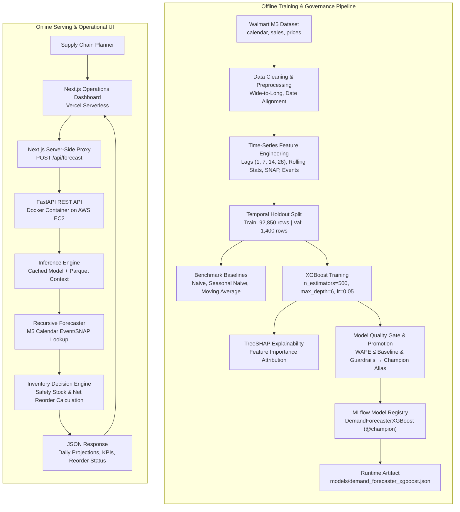
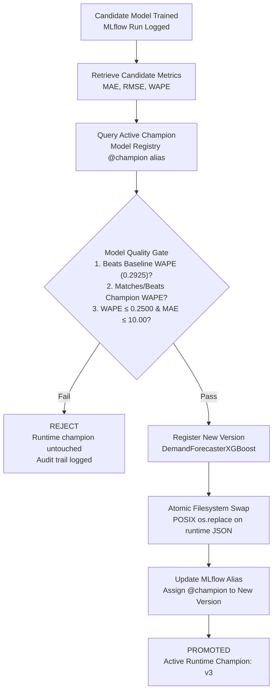

# Demand Forecasting & Inventory Intelligence

An end-to-end machine learning system that translates retail demand forecasts into operational inventory replenishment recommendations. Built with **XGBoost**, **MLflow**, **FastAPI**, **Docker**, **AWS EC2**, and **Next.js** on Walmart M5 retail data, the system models the top 50 high-volume store-product series and automates safe model deployment through an auditable champion/challenger quality gate.

[**View Live Operations Dashboard**](https://demand-forecasting-inventory-intell.vercel.app/)


-FF9900?style=flat&logo=amazonec2&logoColor=white)


---

## Results at a Glance

| Metric | Outcome | Context |
| :--- | :---: | :--- |
| **Forecasting Accuracy (WAPE)** | **22.55%** | **22.90% relative improvement** vs. strongest baseline (Moving Average, 29.25% WAPE) on 28-day holdout. *(1-step teacher-forced validation)* |
| **Stockout Incidence** | **3.50%** | Down from **9.00%** (**61.1% relative reduction**) in 28-day decision-time simulation. |
| **Fulfillment Service Level** | **96.50%** | Up from **91.00%** (**+5.50 percentage points**) in 28-day decision-time simulation. |
| **Modeled Inventory Cost** | **-16.00%** | Simulation cost decreased from **14.13 to 11.87** under asymmetric holding vs. stockout penalties. |

> [!NOTE]
> **Evaluation Distinction:** The 22.55% WAPE reflects 1-step teacher-forced validation on historical actuals across the 28-day holdout. Multi-step recursive forecasts generated in production accumulate autoregressive variance across 7, 14, and 30-day horizons. Inventory simulation metrics reflect an offline periodic-review policy simulation rather than empirical post-deployment store savings.

---

## Problem

Retail inventory managers face an operational tension: under-ordering causes stockouts and lost revenue, while over-ordering ties up working capital in holding costs, strains physical warehouse space, and increases obsolescence risk.

Simple forecasting heuristics can struggle to capture changing demand patterns involving recent demand, seasonality, calendar effects, and promotional/SNAP signals. This project implements a machine learning system that captures these temporal patterns with XGBoost, benchmarks performance against standard time-series baselines, and translates statistical demand forecasts directly into safety-stock-buffered replenishment recommendations.

---

## Solution

The system implements a closed-loop decision workflow:

- **Time-Series Feature Engineering:** Generates autoregressive lags, rolling window statistics, calendar attributes, selling prices, and state-level SNAP subsidy indicators without lookahead leakage.
- **Gradient Boosted Forecasting:** Trains an XGBoost regression model on a strictly chronological train/validation split.
- **Recursive Multi-Step Inference:** Rolls predictions forward over configurable planning horizons (7, 14, or 30 days), dynamically updating lag and rolling features while querying known calendar holiday events and SNAP dates.
- **Inventory Recommendation Layer:** Converts point forecasts into net reorder recommendations using a safety stock buffer configured to balance stockout risk against inventory holding costs.
- **Full-Stack Serving & Observability:** Serves predictions via a high-performance FastAPI backend containerized with Docker on AWS EC2, accessed through an interactive Next.js operations dashboard.

---

## Key Results

### 1. Forecasting Accuracy (28-Day Temporal Holdout)

All models were evaluated on the final 28-day validation window (2016-03-28 through 2016-04-24, 1,400 observations across the 50 series) using 1-step teacher-forced evaluation:

| Model | MAE | RMSE | WAPE | Relative WAPE vs. Best Baseline | Benchmark Context |
| :--- | :---: | :---: | :---: | :---: | :--- |
| **Naive (Lag 1)** | 12.17 | 19.04 | 31.64% | +8.20% | Prior-day persistence baseline |
| **Seasonal Naive (Lag 7)** | 11.61 | 18.06 | 30.18% | +3.18% | Captures weekly cyclicality |
| **Moving Average (7-Day Mean)** | 11.25 | 16.47 | 29.25% | Baseline (0.00%) | **Strongest baseline**; smooths noise |
| **XGBoost Regressor** | **8.67** | **12.60** | **22.55%** | **-22.90%** | **Primary production model** |

$$\text{Relative WAPE Improvement} = \frac{29.2454\% - 22.5481\%}{29.2454\%} = \mathbf{22.90\%}$$

*Exact holdout values from `reports/baseline_results.csv`: Naive MAE 12.1736, RMSE 19.0373, WAPE 31.6437%; Seasonal Naive MAE 11.6086, RMSE 18.0619, WAPE 30.1751%; Moving Average MAE 11.2509, RMSE 16.4727, WAPE 29.2454%; XGBoost MAE 8.6744, RMSE 12.6023, WAPE 22.5481%.*

### 2. Decision-Time Inventory Simulation (28-Day Window)

To evaluate operational impact, a closed-loop periodic-review simulation was executed across all 50 series over the 28-day validation period, comparing a 7-day Moving Average heuristic against the XGBoost forecast-driven policy:

| Strategy | Stockout Rate | Service Level | Avg. Excess Inventory | Modeled Inventory Cost |
| :--- | :---: | :---: | :---: | :---: |
| **7-Day Moving Average Baseline** | 9.00% | 91.00% | 52.61 units | 14.13 |
| **XGBoost Forecast-Driven Policy** | **3.50%** | **96.50%** | 61.52 units | **11.87** |
| **Operational Impact** | **-5.50 pp** (61.1% rel. reduction) | **+5.50 pp** improvement | +8.91 units strategic buffer | **-16.00%** net cost reduction |

*Simulation parameters: 7-day review cycle, 20% safety stock buffer, unit holding cost = 0.10/day, unit stockout penalty = 2.00/unit. Output logged in `reports/inventory_simulation_decision_time.csv`.*

---

## Architecture

The system decouples offline model training and MLOps governance from online low-latency inference and operations dashboard serving:



### Production Request Flow

1. The planner selects a Store, Product, Available Inventory, and Planning Horizon (7, 14, or 30 days) in the Next.js UI.
2. The browser dispatches a `POST` request to the Next.js server-side route `/api/forecast`.
3. The server-side proxy reads `process.env.BACKEND_API_URL` and forwards the payload to the FastAPI backend on AWS EC2, shielding internal infrastructure and preventing browser CORS constraints.
4. FastAPI executes cached recursive inference, applies safety stock calculations, and returns structured daily predictions and replenishment recommendations.

---

## Dataset

The project utilizes the [Kaggle M5 Forecasting – Accuracy](https://www.kaggle.com/competitions/m5-forecasting-accuracy/data) benchmark, consisting of hierarchical retail sales data from Walmart across three US states (California, Texas, Wisconsin):

- `calendar.csv`: Contains calendar dates, day-of-week, event/holiday names, and SNAP allowance flags per state (1,969 total days covering 2011-01-29 through 2016-06-19). Tracked in git for reproducible calendar lookups.
- `sales_train_validation.csv`: Daily unit sales per store-item combination (gitignored, ~101 MB).
- `sell_prices.csv`: Weekly store- and item-level selling prices (gitignored, ~143 MB).

### MVP Scope & Selection
- The complete M5 dataset contains **58,327,370 rows** across 30,490 series.
- **Top 50 Series Scope:** To establish a reproducible, computationally tractable, and production-tested MVP, the modeling pipeline isolates the **top 50 store-item series** ranked by total unit sales volume.
- **Leakage Prevention:** Top-series cohort ranking is calculated strictly on training-period observations prior to the validation cutoff (`date < 2016-03-28`), preventing validation-window information from biasing series selection.
- The modeled dataset spans **94,250 rows and 27 columns** (2011-02-26 through 2016-04-24) after accommodating maximum lag calculation windows.

---

## ML Methodology

```
Data Cleaning ──> Wide-to-Long ──> Feature Engineering ──> Temporal Split ──> Baseline Benchmarks ──> XGBoost ──> Quality Gate ──> SHAP
```

1. **Data Cleaning & Reshaping:** Unpivots daily sales columns (`d_1` to `d_1913`) into long-format time series. Joins calendar attributes and weekly sell prices on date, store, and item keys.
2. **Temporal Validation Split:** Splits data chronologically rather than randomly to prevent future-to-past lookahead leakage:
   - **Training Set:** 2011-02-26 to 2016-03-27 (**92,850 rows**)
   - **Validation Set:** 2016-03-28 to 2016-04-24 (**1,400 rows**, final 28 days across all 50 series)
3. **Benchmark Formulation:** Evaluates standard naive and moving average baselines on the holdout to establish performance floors.
4. **Model Training:** Fits an `XGBRegressor` on squared error loss, monitoring validation MAE.
5. **Quality Gate Verification:** Evaluates candidate model metrics against baselines, champion version, and guardrails before promoting to production.
6. **Explainability Attribution:** Computes TreeSHAP feature attributions on validation samples.

---

## Feature Engineering

The production feature matrix comprises **19 structured features**:

| Feature Category | Features | Description |
| :--- | :--- | :--- |
| **Autoregressive Lags** | `lag_1`, `lag_7`, `lag_14`, `lag_28` | Captures immediate prior-day demand, weekly seasonality, bi-weekly recurrence, and 4-week periodicity. |
| **Rolling Window Statistics** | `rolling_mean_7`, `rolling_mean_14`, `rolling_mean_28`<br/>`rolling_std_7`, `rolling_std_14`, `rolling_std_28` | Trailing demand levels and volatility. Standard deviations computed with sample variance (`ddof=1`) matching inference logic. |
| **Calendar Seasonality** | `day_of_week`, `month_num`, `year_num`, `week_of_year` | Captures intra-week shopping patterns and annual cyclicality. |
| **Exogenous Signals** | `event_flag`, `snap_CA`, `snap_TX`, `snap_WI`, `sell_price` | Binary holiday indicator, state-specific SNAP purchase windows, and item shelf price. |

---

## Forecasting Engine

Inference supports multi-step planning horizons of **7, 14, or 30 days**:

1. **Step 1 ($t+1$):** Predicted using true historical sales observations.
2. **Recursive Autoregression ($t+k$):** For steps $k \ge 2$, model predictions from prior steps ($t+1 \dots t+k-1$) dynamically populate `lag_1`, rolling means, and rolling standard deviations.
3. **Exogenous Calendar Integration:** Future dates deterministically increment calendar attributes (`day_of_week`, `month_num`, `week_of_year`). Future `event_flag` and state SNAP indicators are looked up from the packaged `calendar.csv` file (with graceful fallback to latest historical values if unmapped).
4. **Price Carryover:** Future `sell_price` values are carried forward from the latest available historical observation.

---

## Inventory Intelligence

The inventory decision layer translates statistical demand forecasts into operational procurement recommendations:

$$\text{Recommended Order} = \max\left(0, \, \text{Forecast Demand} + \text{Safety Stock} - \text{Available Inventory}\right)$$

In this MVP policy, safety stock is formulated as a 20% demand buffer:

$$\text{Safety Stock} = 0.20 \times \text{Forecast Demand}$$
$$\text{Recommended Order} = \max\left(0, \, 1.20 \times \text{Forecast Demand} - \text{Available Inventory}\right)$$

### Concrete Example (Verified Production Output)
- **Store:** `CA_1` | **Item:** `FOODS_3_090` | **Horizon:** 7 Days | **Available Inventory:** 100 units
- **Daily Forecasts:**
  - Day 1 (2016-04-25): 38.82 units
  - Day 2 (2016-04-26): 40.61 units
  - Day 3 (2016-04-27): 39.90 units
  - Day 4 (2016-04-28): 43.45 units
  - Day 5 (2016-04-29): 60.70 units
  - Day 6 (2016-04-30): 72.61 units
  - Day 7 (2016-05-01): 67.67 units
- **Total Forecast Demand:** 363.77 units
- **Safety Stock (20%):** 72.75 units
- **Target Inventory:** $363.77 + 72.75 = 436.52$ units
- **Recommended Order:** $\max(0, \, 436.52 - 100.00) = \mathbf{336.53\text{ units}}$

---

## Business Simulation

The decision-time periodic-review simulation models four consecutive 7-day review cycles over the 28-day validation window across all 50 series:

- **Order Timing:** Decisions occur strictly at decision boundaries ($t=0, 7, 14, 21$) using only data available prior to the decision timestamp.
- **Cost Formulation:** Total inventory penalty cost is modeled as:
  $$\text{Cost} = (0.10 \times \text{Excess Inventory}) + (2.00 \times \text{Unmet Demand Units})$$

### Simulation Outcomes
- **Stockout Rate:** Reduced from **9.00% to 3.50%** (a 61.1% relative reduction).
- **Service Level:** Increased from **91.00% to 96.50%** (+5.50 percentage points).
- **Average Excess Inventory:** Increased moderately from 52.61 to 61.52 units (+8.91 units) as the model proactively buffers ahead of anticipated weekend and event demand spikes.
- **Net Modeled Inventory Cost:** Decreased from **14.13 to 11.87** (a **16.00% net cost reduction**) due to the 20:1 asymmetric penalty ratio of stockouts versus inventory holding.

---

## Model Explainability

Feature importance was evaluated using TreeSHAP on validation holdout samples ([`reports/xgboost_shap_feature_importance.csv`](reports/xgboost_shap_feature_importance.csv)):

| Rank | Feature | Mean Absolute SHAP Value | Operational Interpretation |
| :---: | :--- | :---: | :--- |
| **1** | `lag_1` | **8.6712** | Prior-day sales volume is the strongest driver of next-day demand level. |
| **2** | `rolling_mean_7` | **5.6651** | Trailing weekly average captures short-term baseline volume trends. |
| **3** | `day_of_week` | **4.2068** | Captures distinct weekday versus weekend traffic surges. |
| **4** | `rolling_mean_28` | **1.2351** | Long-term 4-week trend level dampens high-frequency variance. |
| **5** | `lag_28` | **1.1194** | Monthly seasonality captures payday and monthly recurring cycles. |


> [!NOTE]
> SHAP measures statistical feature importance within the validation sample and does not assert real-world causal relationships.

---

## MLOps & Model Governance

The repository implements a deterministic champion/challenger deployment pipeline:



- **Fail-Closed Gate:** If MLflow is unavailable, metrics are invalid, or guardrails are breached, candidate promotion immediately aborts and the runtime model remains untouched.
- **Atomic Replacement:** The runtime file (`models/demand_forecaster_xgboost.json`) is staged in a temporary file and atomically swapped using POSIX `os.replace` to prevent race conditions or corrupted reads.
- **Active Champion:** Model `DemandForecasterXGBoost` version **3** is the current champion under alias `@champion` (training run `4183d9a6ae91402da1c7814502c53fb7` initial promotion; candidate `4df4aa9f91154423b0ab1baa3728b56d` promoted to v3).
- **Runtime Serving:** The FastAPI application serves from the promoted local JSON artifact rather than executing network queries against MLflow on each inference request.

---

## API Specification

The backend service is built with **FastAPI** and served via Uvicorn.

### 1. Health Check
- **Endpoint:** `GET /health`
- **Response:**
  ```json
  {
    "status": "healthy",
    "service": "demand-forecasting-api"
  }
  ```

### 2. Demand Forecast & Inventory Recommendation
- **Endpoint:** `POST /forecast`
- **Request Body:**
  ```json
  {
    "store_id": "CA_1",
    "item_id": "FOODS_3_090",
    "available_inventory": 100,
    "forecast_days": 7
  }
  ```
  *(Supported `forecast_days`: `7`, `14`, or `30`)*

- **Response Body (HTTP 200):**
  ```json
  {
    "store_id": "CA_1",
    "item_id": "FOODS_3_090",
    "forecast_days": 7,
    "daily_forecast": [
      {"date": "2016-04-25", "forecast": 38.82372283935547},
      {"date": "2016-04-26", "forecast": 40.61270523071289},
      {"date": "2016-04-27", "forecast": 39.903804779052734},
      {"date": "2016-04-28", "forecast": 43.446739196777344},
      {"date": "2016-04-29", "forecast": 60.702064514160156},
      {"date": "2016-04-30", "forecast": 72.61231231689453},
      {"date": "2016-05-01", "forecast": 67.67041015625}
    ],
    "inventory": {
      "forecast_demand": 363.77,
      "available_inventory": 100.0,
      "safety_stock": 72.75,
      "recommended_order": 336.53
    }
  }
  ```

---

## Operations Dashboard

The dashboard is built with **Next.js (App Router), TypeScript, Tailwind CSS, shadcn/ui, and Recharts**. Planners can select store/SKU combinations, adjust available inventory, toggle planning horizons, view KPI summary cards, and inspect interactive daily demand forecasts.

### 7-Day Planning Horizon


### 14-Day Planning Horizon


---

## Production Deployment

- **Live Demo Frontend:** [https://demand-forecasting-inventory-intell.vercel.app/](https://demand-forecasting-inventory-intell.vercel.app/)
- **Production Backend:** FastAPI backend containerized on AWS EC2 (Amazon Linux 2023, ARM64 `t4g.small`).
  - *Public endpoints:* `GET http://3.80.207.155:8000/health` and `POST http://3.80.207.155:8000/forecast`
- **Container Architecture:** Backend Docker image packages `requirements-prod.txt`, `model_data.parquet`, `demand_forecaster_xgboost.json`, and `calendar.csv`.
- **Security & Proxy:** The frontend uses a server-side Next.js route proxy (`/api/forecast`) that communicates with the EC2 backend via environment variable `BACKEND_API_URL`, preventing browser-side mixed-content and CORS issues.

---

## Project Structure

```
.
├── .github/
│   └── workflows/
│       └── ci.yml             # GitHub Actions pipeline (Python CI + Frontend CI)
├── data/
│   ├── raw/
│   │   ├── calendar.csv       # M5 calendar & SNAP indicator lookup (tracked in git)
│   │   ├── sales_train_validation.csv # (gitignored)
│   │   └── sell_prices.csv    # (gitignored)
│   └── processed/
│       ├── m5_sales_long.parquet # Cleaned long-format table (gitignored)
│       └── model_data.parquet    # Feature matrix for 50 series (gitignored)
├── docs/
│   └── images/                # Dashboard application screenshots
│       ├── dashboard-7-day-forecast.png
│       └── dashboard-14-day-forecast.png
├── frontend/                  # Next.js 16 App Router application
│   ├── src/
│   │   ├── app/
│   │   │   ├── api/forecast/route.ts # Server-side API proxy
│   │   │   └── page.tsx              # Operations dashboard UI
│   │   └── components/               # shadcn/ui and custom widgets
│   ├── Dockerfile
│   └── package.json
├── models/
│   └── demand_forecaster_xgboost.json # Promoted champion runtime artifact
├── reports/
│   ├── figures/               # Evaluation plots and generation script
│   │   ├── baseline_vs_xgboost_wape.png
│   │   ├── inventory_simulation_kpis.png
│   │   └── shap_feature_importance.png
│   ├── baseline_results.csv   # Verified baseline benchmark metrics
│   ├── inventory_simulation_decision_time.csv # Verified simulation metrics
│   └── xgboost_shap_feature_importance.csv    # Verified SHAP metrics
├── src/
│   ├── api.py                 # FastAPI REST application with lifespan caching
│   ├── data/                  # Data ingestion and wide-to-long transformation
│   ├── evaluation/            # Baselines, simulation, SHAP, and promotion logic
│   │   ├── baselines.py
│   │   ├── explain_xgboost.py
│   │   ├── inventory_simulation.py
│   │   ├── promotion.py
│   │   └── quality_gate.py
│   ├── features/              # Leakage-free time-series feature pipeline
│   │   └── build_features.py
│   ├── inference/             # Recursive autoregressive multi-step forecaster
│   │   └── forecast.py
│   ├── inventory/             # Safety stock & replenishment calculation
│   │   └── inventory_recommendation.py
│   └── models/                # XGBoost training and MLflow promotion runner
│       └── train_xgboost.py
├── tests/                     # 84 unit and regression tests
│   ├── test_api.py
│   ├── test_features.py
│   ├── test_forecast.py
│   ├── test_inventory.py
│   ├── test_inventory_simulation.py
│   ├── test_model_promotion.py
│   └── test_quality_gate.py
├── Dockerfile                 # Production backend container spec
├── docker-compose.yml         # Full-stack container orchestration
├── requirements-dev.txt       # Development & training dependencies
├── requirements-prod.txt      # Lightweight production serving dependencies
└── README.md
```

---

## Local Setup & Reproduction

### Prerequisites
- Python 3.11
- Node.js 22+ and npm
- Docker and Docker Compose (optional for containerized execution)

### 1. Repository Setup
```bash
git clone https://github.com/irishz12/Demand-Forecasting-Inventory-Intelligence.git
cd Demand-Forecasting-Inventory-Intelligence

# Create and activate virtual environment
python3 -m venv .venv
source .venv/bin/activate

# Install development dependencies
pip install -r requirements-dev.txt
```

### 2. Running Automated Tests
```bash
# Execute the full 84-test Python test suite
python -m unittest discover -s tests -v
```

### 3. Local Development Servers
**Backend:**
```bash
# Start FastAPI backend on port 8000
uvicorn src.api:app --host 0.0.0.0 --port 8000 --reload
```

**Frontend:**
```bash
# In a separate terminal:
cd frontend
npm install
npm run dev
# Dashboard accessible at http://localhost:3000
```

### 4. Running with Docker Compose
To launch both services in connected containers:
```bash
docker compose up --build
```
- **Dashboard:** [http://localhost:3000](http://localhost:3000)
- **API Documentation:** [http://localhost:8000/docs](http://localhost:8000/docs)

---

## Testing & Continuous Integration

The repository maintains an automated test suite across **84 unit and regression tests**:

| Test Module | Test Count | Scope |
| :--- | :---: | :--- |
| `tests/test_api.py` | 13 | Request validation, Pydantic constraints, `/health` and `/forecast` route handling. |
| `tests/test_features.py` | 2 | Regression tests verifying pre-validation series selection without temporal leakage. |
| `tests/test_forecast.py` | 8 | Feature column contracts, rolling std sample variance (`ddof=1`), calendar lookup, fallback handling. |
| `tests/test_inventory.py` | 15 | Safety stock formulas, boundary conditions, zero-demand and negative inventory handling. |
| `tests/test_inventory_simulation.py` | 1 | Regression test verifying decision-date deduplication during weekly history rollover. |
| `tests/test_model_promotion.py` | 17 | Atomic replacement, fail-closed MLflow resolution, alias assignment, rollback prevention. |
| `tests/test_quality_gate.py` | 28 | Pure deterministic gate checks, guardrail threshold boundaries, malformed metric rejection. |

**GitHub Actions CI (`.github/workflows/ci.yml`):**
- **Python CI:** Installs production dependencies, validates core module imports, and executes all 84 tests.
- **Frontend CI:** Installs npm dependencies, runs ESLint, and compiles the Next.js production build (`next build`).

---

## Known Limitations

1. **Modeling Cohort Scope:** Models the top 50 high-volume store-item series rather than all 30,490 series in the complete M5 dataset.
2. **Validation Evaluation Regime:** The 22.55% WAPE is measured using 1-step teacher-forced validation on historical actuals. Recursive multi-step forecasts in live deployment compound autoregressive error over 7, 14, and 30-day horizons.
3. **Inventory Heuristic:** Safety stock uses a configured 20% demand percentage heuristic rather than a dynamic stochastic inventory optimization solver (e.g., continuous review $(s, S)$ policies or lead-time variance modeling).
4. **Price Carryover:** Future selling prices are carried forward from the latest observed price rather than modeled via dynamic pricing elasticity.
5. **Autoregressive Compounding:** Forecast variance increases over longer horizons (14 and 30 days) as predictions feed subsequent lag and rolling calculations.
6. **Decoupled Runtime:** The production container serves from a validated local JSON model artifact rather than querying the MLflow Model Registry dynamically on every HTTP request.

---

## Future Improvements

- **Scale Coverage:** Expand feature extraction and partitioned training across all store-item categories.
- **Dynamic Price & Promotion Modeling:** Ingest external planned promotional calendars and price elasticity curves.
- **Probabilistic Forecasting:** Implement quantile loss objectives to produce predictive intervals ($P_{10}, P_{50}, P_{90}$) directly supporting service-level safety stocks.
- **Multi-Horizon Validation:** Implement backtesting on recursive multi-step forecasts (7, 14, 30 days) alongside teacher-forced 1-step validation.
- **Stochastic Inventory Policies:** Incorporate supplier lead-time distribution modeling and order batch constraints.
- **Drift Detection:** Automate feature distribution and prediction drift tracking in production.

---

## Tech Stack

| Domain | Technologies |
| :--- | :--- |
| **Machine Learning** | XGBoost, scikit-learn, SHAP, NumPy, pandas |
| **Data Processing** | pyarrow, Parquet |
| **MLOps & Tracking** | MLflow, Custom Quality Gate Orchestrator, GitHub Actions |
| **Backend Serving** | FastAPI, Uvicorn, Pydantic |
| **Frontend UI** | Next.js 16 (App Router), TypeScript, Tailwind CSS v4, shadcn/ui, Recharts |
| **Infrastructure** | Docker, Docker Compose, AWS EC2 (Amazon Linux 2023, ARM64), Vercel |

---

## License

This repository does not currently specify an open-source license. All rights are reserved by the repository owner.
